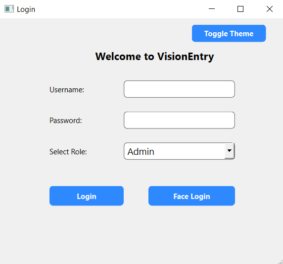
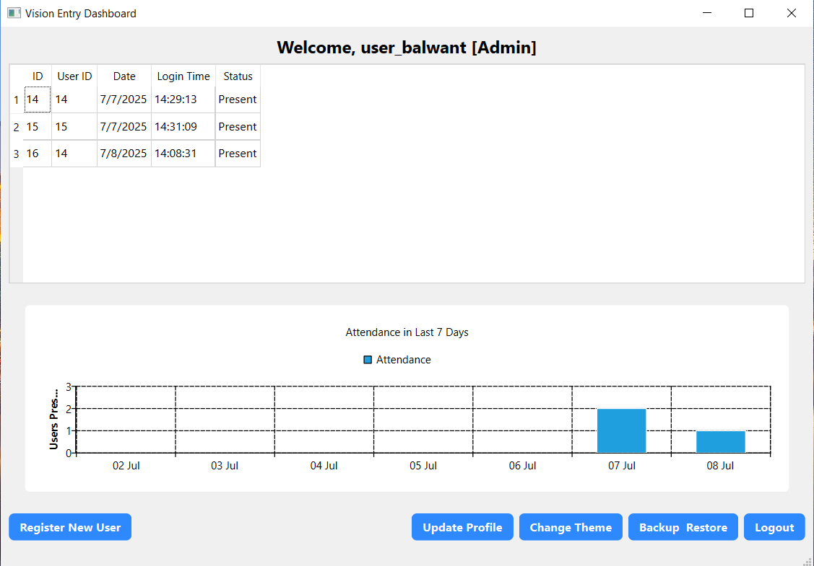
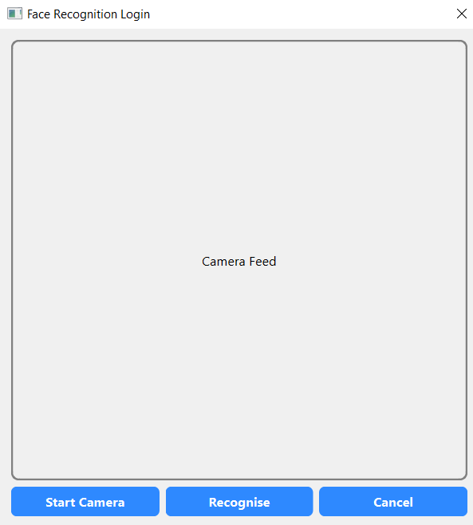
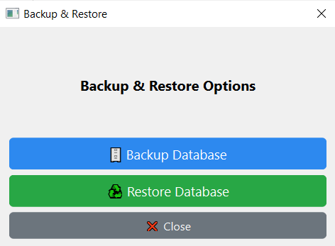

# 🚀 VisionEntry – Face Recognition Attendance System

  

A modern **Face Recognition-based Attendance System** built with **C++ (Qt)**, **OpenCV**, **MySQL**, and **Python** for reliable and secure authentication.

---

## 🧠 Features

- 🔐 Face-based Login & Attendance Verification
- 🧑‍💼 Role-based Dashboard (Admin, HR, Employee)
- 📊 Real-time Attendance Charts (Last 7 Days)
- 📝 User Profile Management
- 💡 Light & Dark Theme Toggle
- 🔒 Passwords stored securely using SHA-256
- 🗃️ Admin-only Backup & Restore (MySQL DB)
- 📋 Logging System (Info, Error, Warning)

---

## 🛠️ Tech Stack

| Component     | Technology             |
|---------------|-------------------------|
| UI            | Qt 6.5                  |
| DB            | MySQL                   |
| Face Detection| OpenCV + Python         |
| Charts        | Qt Charts               |
| Logger        | Custom Logger (Singleton) |
| Build System  | QMake                   |

---

## 🖼️ Screenshots

- **Login Screen**  
  

- **Dashboard**  
  

- **Face Verification Popup**  
  

- **Attendance Chart**  
  

- **Backup & Restore Dialog**  
  

---

## 🔧 How to Run

### ⚙️ Prerequisites

- **Qt 6.5 or above**
- **Python 3.x** (with OpenCV installed)
- **MySQL Server** (Create `vision_entry` DB and required tables)
- **CMake / QMake** (via Qt Creator)

### 🛠️ Setup

```bash
git clone https://github.com/balwantsinghmnit/VisionEntry.git
```
cd VisionEntry
Open VisionEntry.pro in Qt Creator

Configure MySQL connection in DBManager.cpp

Build the project

Ensure Python & MySQL are accessible from system PATH
```bash
📂 Project Structure
VisionEntry/
├── src/                     # C++ source code (Qt)
├── python_scripts/          # Python scripts for face recognition
├── resources/               # Icons and style sheets
├── screenshots/             # UI screenshots
├── config/                  # Config files (database credits)
├── VisionEntry.pro          # Qt project file
└── README.md
📁 Python Scripts
Script	Description
face_register.py	Registers face and encodes it
face_recognise.py	Compares face & returns user ID

Used internally via QProcess from Qt

🧠 Roles and Permissions
Role	Access
Admin	Full access (users, charts, backup/restore)
HR	Can view attendance, register users
Employee	Can only mark own attendance

🧪 Face Verification Flow
User clicks Face Login or Mark Attendance

FaceLoginDialog opens and captures live image

Saved as temporary file → passed to face_recognise.py

If face matches, attendance is marked in DB

🗃️ MySQL Database Setup
📁 Database Name: vision_entry
📄 Required Tables:
🔸 1. users — For login system
Field	Type	Notes
id	INT PRIMARY KEY AUTO_INCREMENT	Unique user ID
username	VARCHAR(50)	Unique login name
password	VARCHAR(255)	Hashed (SHA-256)
role	ENUM('Admin','HR','Employee')	Role-based access
full_name	VARCHAR(100)	Display name

🔸 2. face_data — To store face encodings
Field	Type	Notes
user_id	INT	Foreign Key → users(id)
encoding	BLOB	Serialized face encoding

🔸 3. attendance — Attendance records
Field	Type	Notes
id	INT PRIMARY KEY AUTO_INCREMENT	Unique attendance ID
user_id	INT	Foreign Key → users(id)
timestamp	DATETIME	When attendance marked
status	VARCHAR(20)	e.g., "Present"

✍️ Author
Balwant Singh
📧 balwantsinghmnit@gmail.com

📄 License: MIT
